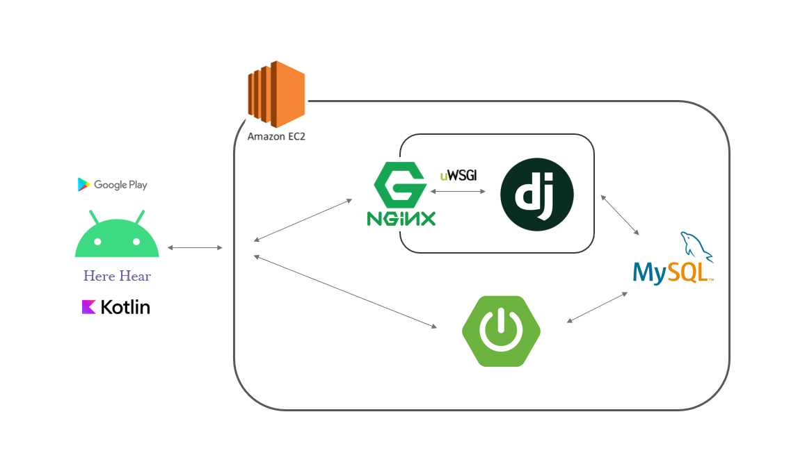
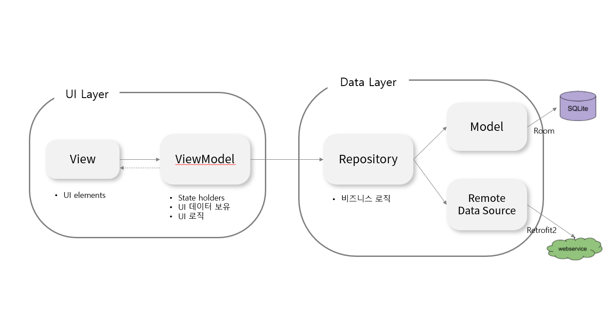

# Here Hear

> - 독서 기록 및 오디오북 변환 안드로이드 App
>- 독서 습관 형성 및 독서 환경 제공 서비스
> - 개발팀 : 내경에 귀읽기
>- 개발 기간: 2021.08.30 ~ 2021.10.08
> - [:clapper: UCC](https://youtu.be/drAe9w6C9G0)
>- [:link: 플레이스토어](https://play.google.com/store/apps/details?id=com.ssafy.herehear )

## :memo: 서비스 개요

- 2019 문화체육관광부가 시행한 국민 독서 실태 조사에 따르면, 한국 성인의 48%는 종이책을 한 권도 읽지 않는다고 합니다.
- 또한, 여러 기관의 독서를 하지 않는 이유에 대한 설문 조사 결과, 성인의 경우 업무로 인한 **시간이 없어서** 혹은 **습관이 들지 않아서**가 주된 이유라는 것을 알 수 있었습니다.
- 이러한 문제를 해결하기 위해 **독서습관**을 기르고, **종이책과 ebook의 불편함을 해소**하고자 Here Hear를 만들게 되었습니다.
- Here Hear는 쉽고 간편한 독서기록을 통해 책 읽는 습관을 길러주고, 원하는 글을 담은 사진을 오디오로 변환해 편하게 들을 수 있는 서비스입니다. 

## :star: 주요 기능

- :speaker:오디오북 변환
  - 글 사진을 찍고 등록하면 오디오로 들을 수 있습니다.
  - 책마다 오디오를 등록해서 들을 수 있습니다.
- :calendar: 독서 캘린더
  - 책을 읽은 날짜, 책을 읽은 시간, 감상평을 캘린더를 통해 확인할 수 있습니다.
- :book: 도서 추천
  - 사용자가 여러 도서에 매기는 평점을 기반으로 잠재요인을 분석해, 나와 비슷한 독서 취향의 사람의 책들을 추천해줍니다.

## ✋ 맡은 역할

- 기획
- 안드로이드 개발
  - 오디오 변환 및 플레이 기능
  - 캘린더 기능

## 프로젝트 구조

## 안드로이드 구조

### :man_technologist: 기술스택

`Kotlin`, `MVVM`, `RxJava`, `AAC`, `ViewModel`, `LiveData`, `MediaPlayer`, `WorkManager`, `Coroutine`, `OkHttp`, `Retrofit2`, `Hil
