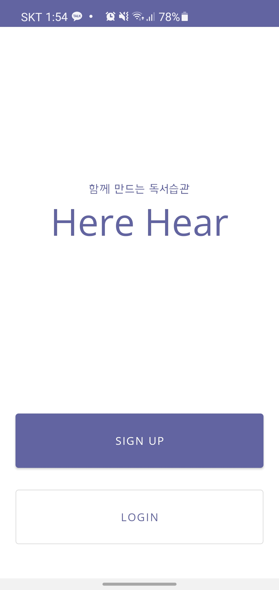

# 포팅매뉴얼

# 1. 사전 준비

## 1) openJDK11 설치

## 2) java 환경변수 설정

- [PATH]
  
    앞서 설치한 jdk에는 java/javac등 우리에게 필요한 파일을 어디서나 CLI로 실행하기 위해서는 PATH라는 환경변수에 등록되어 있어야 한다.
    
- [JAVA_HOME]
  
    Tomcat을 실행시킬 때 JAVA_HOME변수에서 jdk를 확인하기 때문에 필요

# 2. gitlab 소스 클론 이후 빌드 및 배포 관련

## 1) 웹서버

- [uWSGI]
  
    : version 2.0.19.1
    
- [NGINX]
  
    : version 1.18.0
    
- [Apache Server]

## 2) WAS

- [Tomcat]
    - Tomcat9

## 3) Back-End

- [Eclipse]
    - Eclipse Java 2018-09 이후 버전
- [Spring Tool Suite3]
    - sts-3.9.13 RELEASE 버전
- [MySql]
    - MySQL Workbench 8.0
- [Redis]
    - Redis 3.2.100
- [JPA]
    - spring.jpa.hibernate.naming.implicit-strategy=org.springframework.boot.orm.jpa.hibernate.SpringImplicitNamingStrategy
    - spring.jpa.hibernate.naming.physical-strategy=org.springframework.boot.orm.jpa.hibernate.SpringPhysicalNamingStrategy
    - spring.jpa.hibernate.ddl-auto=update
    - spring.jpa.properties.hibernate.dialect=org.hibernate.dialect.MySQL57Dialect
- [JWT]
    - $ echo 'spring-boot-ssafy-pjt-herehear-jwt-secret-spring-boot-ssafy-pjt-herehear-jwt-secret' | base64
    - jwt.secret=c3ByaW5nLWJvb3Qtc3NhZnktcGp0LWhlcmVoZWFyLWp3dC1zZWNyZXQtc3ByaW5nLWJvb3Qtc3NhZnktcGp0LWhlcmVoZWFyLWp3dC1zZWNyZXQK
- [Swagger]
    - API 생성 및 테스트
- [Gradle]
  
    ```jsx
    def querydslDir = 'src/main/generated'
    querydsl {
        library = "com.querydsl:querydsl-apt"
        jpa = true
        querydslSourcesDir = querydslDir
    }
    
    sourceSets {
        main {
            java {
                srcDirs = ['src/main/java', querydslDir]
            }
        }
    }
    
    compileQuerydsl {
        options.annotationProcessorPath = configurations.querydsl
    }
    
    configurations {
        querydsl.extendsFrom compileClasspath
    }
    ```

## 4) Front-End

- [Android Studio]
    - 2020.3.1 version
- [Android sdk]
    - compileSdk 31
    - targetSdk 31
- 빌드환경
  
    ```jsx
    buildTypes {
    	release {
    	minifyEnabled false
    	proguardFiles getDefaultProguardFile('proguard-android-optimize.txt'), '[proguard-rules.pro](http://proguard-rules.pro/)'
    	}
    }
    compileOptions {
        sourceCompatibility JavaVersion.VERSION_1_8
        targetCompatibility JavaVersion.VERSION_1_8
    }
    
    kotlinOptions {
        jvmTarget = '1.8'
    }
    ```

## 5) AI

- [Visual Studio Code]
- requirements.txt 참고

## 6) 빌드 환경변수

- [gradle]
    - distributionBase=GRADLE_USER_HOME
    - distributionPath=wrapper/dists
    - distributionUrl=https\://services.gradle.org
    - distributions/gradle-7.1.1-bin.zip
    - zipStoreBase=GRADLE_USER_HOME
    - zipStorePath=wrapper/dists

# 3. 배포 특이사항

- nginx, uwsgi 버퍼사이즈 및 응답시간 재설정(파일 전송을 위한 작업)

# 4. 데이터베이스

- [DataSource]
    - spring.datasource.url=jdbc:mysql://localhost:3306/herehear_db?useUnicode=true&characterEncoding=utf8&serverTimezone=Asia/Seoul&zeroDateTimeBehavior=convertToNull&rewriteBatchedStatements=true
    - spring.datasource.driver-class-name=com.mysql.cj.jdbc.Driver
    - spring.datasource.hikari.username=ssafy
    - spring.datasource.hikari.password=ssafy
    - spring.cache.type=redis
    - spring.redis.host=localhost
    - spring.redis.port=6379
    
- [주요계정]
  
    1) 관리자
    
    없음
    
    2) 사용자
    
    ID: ssafy1 / PW: ssafy1
    
- [ERD]


# 5. 시연 시나리오

- 앱 접속 시 중앙에 로고가 나오고, 하단에 회원가입과 로그인 버튼이 뜬다.




- 로그인을 하면 내 서재로 화면이 이동한다.
- 내 서재에는 읽음 상태에 따라 '읽고 있는 책', '읽기 전 책', '다 읽은 책'으로 나누어 볼 수 있다.
- 도서 목록은 좌우로 드래그하여 넘겨볼 수 있다.


- 내 서재에서 책을 한 권 골라서 누르면 상세 페이지로 이동한다.
- 상세 페이지에는 책의 표지, 제목, 간단한 줄거리가 나오며 사용자가 별을 눌러 별점을 매길 수 있다. (책 읽기를 완료하지 않은 책은 언제든지 별점을 수정할 수 있다.)
- 하단의 감상평 항목에서는 사용자가 해당 책에 작성한 감상평을 옆으로 넘기며 볼 수 있다.
- 우측 상단의 체크 표시를 누르면 책 읽기가 완료되어 '다 읽은 책'으로 넘어간다.
- 우측 상단의 책 모양을 누르면 독서방식 선택 모달이 나온다.


- 독서 방식 선택 모달에는 종이책, 오디오 두 가지 방식이 있다.


- 오디오를 선택했을 경우, 실물 도서를 오디오북으로 변환하기 위해 하단에 카메라와 갤러리 버튼이 나온다.
- 카메라를 선택 할 경우, 원하는 도서의 듣고 싶은 부분을 사진찍는다.
- 갤러리를 선택 할 경우, 기존에 찍어 두었던 책 사진을 업로드 한다.
- 우측 상단의 다음 버튼을 누르면 오디오북 변환이 시작된다.
- 오디오북으로 변환하는 동안 변환중이라는 메세지와 함께 로딩바가 돌아간다.


- 오디오북 변환이 완료되면 책 읽기 화면으로 넘어온다.
- 하단의 재생버튼을 클릭하면 오디오북을 들을 수 있다.
- 재생버튼을 누른 시점부터 독서 시간이 측정된다.
- 중지 버튼을 클릭하면 오디오북이 멈추고 읽기가 종료된다.


- 책 읽기를 종료하면 한줄 감상평 작성 화면이 나온다.
- 작성한 감상평은 내 서재의 도서 상세 페이지, 도서 캘린더에서 확인할 수 있다.


- 독서 방식 선택에서 종이책을 선택했을 경우 바로 해당 화면으로 넘어온다.
- 하단의 재생 및 일시정지 버튼을 누르면, 상단에 독서 시간이 측정된다.
- 책 읽기를 종료할 경우 하단의 중지 버튼을 누르면 한줄 감상평 작성 화면으로 넘어간다.
- 이후의 시나리오는 오디오북과 동일하다.


- 하단 네비게이션바의 두번째 버튼을 누르면 독서 캘린더 화면으로 전환된다.
- 독서 캘린더에서는 날짜를 누르면 해당 일자의 독서 기록을 확인할 수 있다.


- 하단 네비게이션바의 세번째 버튼을 누르면 도서 검색 화면으로 이동한다.
- 아무것도 검색하지 않았을 때는 사용자의 서재 도서를 기반으로 비슷한 도서 목록을 가지고 있는 다른 유저의 도서와 비교하여 추천 도서가 렌더링 된다.
- 도서 검색은 우측 상단에 드롭박스로 제목검색, 작가검색 두 가지 옵션이 있다.
- 좌측 상단 검색창에 검색어를 입력하면 해당 검색어와 동일한 검색결과가 최상단에 나오고, 이후는 해당 검색어가 포함된 결과들이 나온다.


